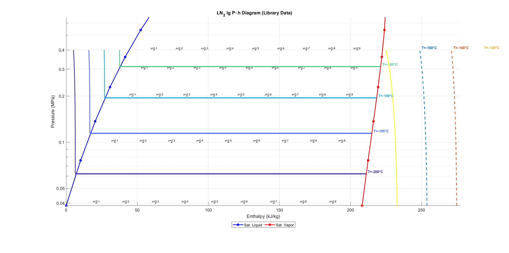
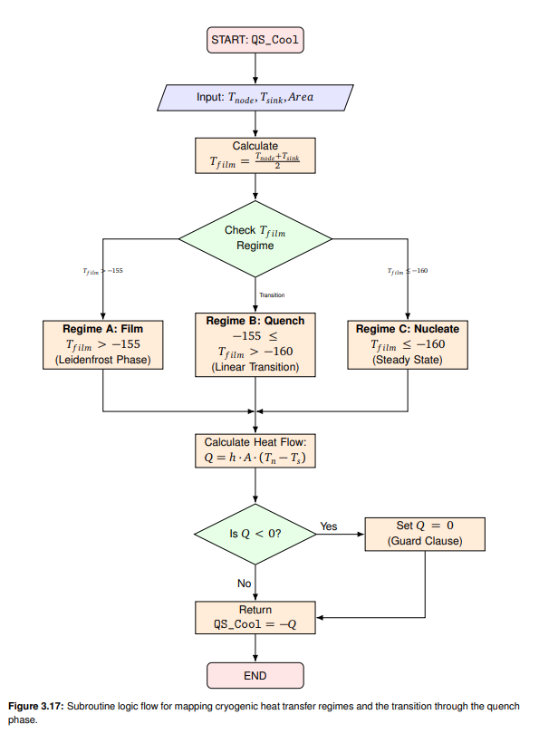
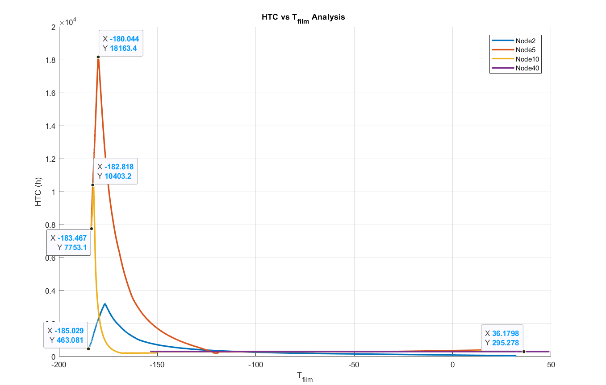
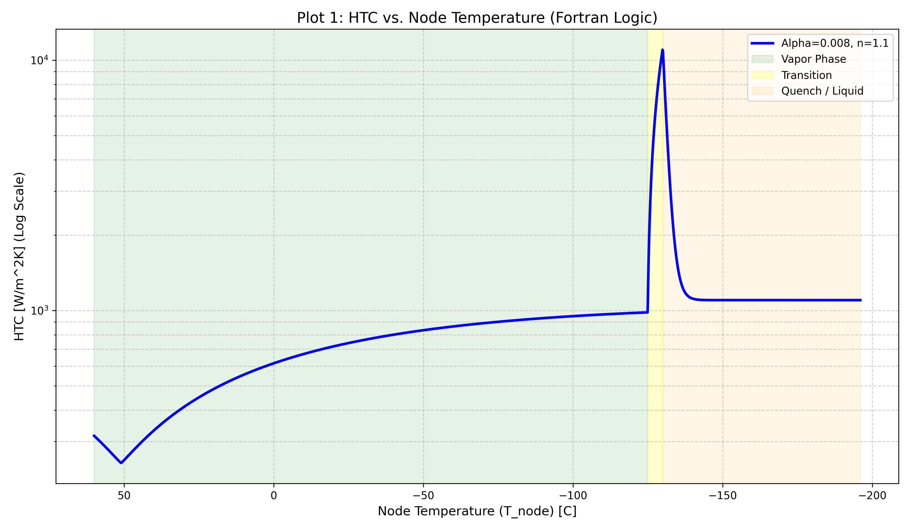

# TVAC Digital Twin: Systems Logic & Thermal Architecture 🛰️

## Overview
This repository contains the logical architecture and physical models developed for a **Digital Twin** of a Cryogenic Thermal Vacuum (TVAC) chamber. The goal was to optimize simulation performance while maintaining high-fidelity model-to-test correlation for satellite component testing.

---

## 1. Thermo-Physical Foundations
### Nitrogen Property Library (P-h Mapping)
To accurately predict Nitrogen (LN2) behavior in subcooled and two-phase regimes, I developed a property interpolation logic. 

*The logarithmic Pressure-Enthalpy mapping ensures that the ESATAN-TMS solver respects phase-change boundaries during extreme cooling transients.*

---

## 2. Heat Transfer & Fluid Dynamics
### Dynamic HTC Logic
Heat Transfer Coefficients (HTC) are updated dynamically based on film temperature. 

*By automating the HTC update loop, the model captures the transition between boiling regimes, a critical factor for cryogenic cooling accuracy.*

---

## 3. Reduced-Order Modeling (ROM)
### The 10-Minute Simulation Logic
The core achievement of this project was reducing a multi-day simulation into a **10-minute runtime** using a physics-based iteration loop.

*The logic utilizes an energy balance and enthalpy update system to track LN2 temperature states without the computational overhead of a full fluid-node solver.*

---

## 4. Hardware Safety & Control
### PID & Heater Protection interlocks
Industrial TVAC operations require strict safety protocols to protect vacuum panels and heater wires from thermal shock.

.png)

*These interlocks ensure the system operates within safe structural limits during rapid heating and cooling cycles.*

---

## Technical Tooling
- **Simulation:** ESATAN-TMS
- **Logic Design:** Fortran, LaTeX (TikZ for flowcharts)
- **Data Analysis:** Python (NumPy, Matplotlib)

*Note: This work was conducted as part of a Bachelor’s Thesis at SpaceTech GmbH in collaboration with the Technical University of Munich (TUM).*
